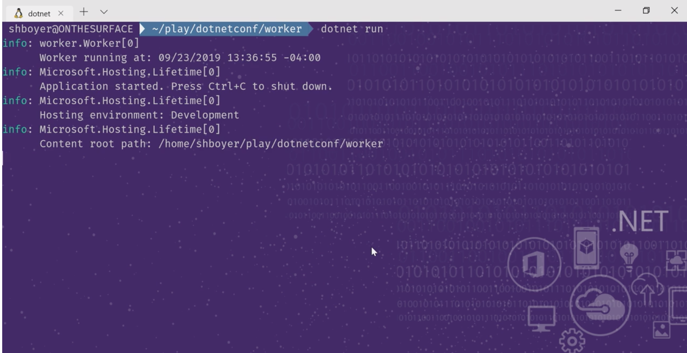

# dotnetconf-wsl-theme

By popular demand, my WSL theme is here from [#dotnetconf](https://dotnetconf.net)

I presented [Building Cloud Native Apps with .NET Core 3.0 and Kubernetes](https://channel9.msdn.com/Events/dotnetConf/NET-Conf-2019/B108?WT.mc_id=dotnetconf-ch9-shboyer) and during the presentation I used [WSL for Linux](https://docs.microsoft.com/windows/wsl/install-win10?WT.mc_id=wsl-github-shboyer) to perform the command line tasks for `dotnet new, build, run`



If you need to get WSL setup on Windows, Burke Holland has a great guide here - [Moving Your JavaScript Development To Bash On Windows](https://www.smashingmagazine.com/2019/09/moving-javascript-development-bash-windows/)

## Color Theme

The color schema is "Earth" from Burke's theme and looks great on the purple background.

```javascript
{
  "background": "#ffffff",
  "black": "#ffffff",
  "blue": "#336699",
  "brightBlack": "#767676",
  "brightBlue": "#42E1F5",
  "brightCyan": "#61D6D6",
  "brightGreen": "#06CA95",
  "brightPurple": "#B4009E",
  "brightRed": "#E74856",
  "brightWhite": "#F2F2F2",
  "brightYellow": "#F9F1A5",
  "cyan": "#3A96DD",
  "foreground": "#CCCCCC",
  "green": "#06CA95",
  "name": "Earth",
  "purple": "#881798",
  "red": "#C50F1F",
  "white": "#CCCCCC",
  "yellow": "#C19C00"
}
```

Ubuntu 18.04 is the Linux distro I am using, and can be [acquired from the Windows Store](https://www.microsoft.com/store/p/ubuntu/9nblggh4msv6?WT.mc_id=wsl-github-shboyer).

The theme setup in my settings.json for Ubuntu looks like the following, notice the reference to the "Earth" theme.

```javascript
{
  "acrylicOpacity": 0.5,
  "tabTitle" :  "ubuntu",
  "backgroundImage": "c:/Users/shboyer/Pictures/dotnet_bg.png",
  "closeOnExit": false,
  "colorScheme": "Earth",
  "commandline": "wsl.exe -d Ubuntu",
  "cursorColor": "#FFFFFF",
  "cursorShape": "bar",
  "fontFace": "Fira Code",
  "fontSize": 12,
  "guid": "{2c4de342-38b7-51cf-b940-2309a097f518}",
  "historySize": 9001,
  "icon": "ms-appx:///ProfileIcons/{9acb9455-ca41-5af7-950f-6bca1bc9722f}.png",
  "name": "Ubuntu",
  "padding": "0, 0, 0, 0",
  "snapOnInput": true,
  "useAcrylic": false
},
```

### Background

`dotnet_bg.png`

